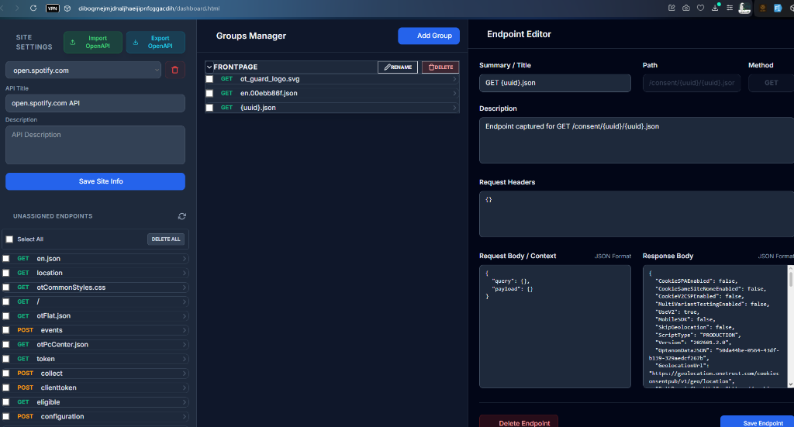
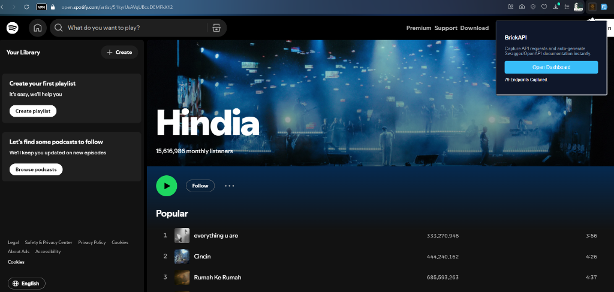

# BrickAPI 🧱
**Capture API requests and auto-generate Swagger/OpenAPI documentation instantly.**

BrickAPI is a high-performance Chrome Extension that eliminates manual documentation by capturing real-time network traffic and transforming it into production-ready OpenAPI specifications.

## ✨ Key Features
- **Intelligent Traffic Sniffer**: Capture Headers, Payloads, and JSON with zero latency.
- **One-Click OpenAPI Export**: Transform raw captured data into structured OpenAPI 3.1 YAML/JSON.
- **Data Sanitization**: Built-in PII masking for sensitive data (tokens, keys, etc.).
- **Smart Organization**: Seamlessly categorize endpoints using **Drag-and-Drop** between custom groups and the unassigned pool.
- **Group Management**: Reorder entire documentation sections effortlessly with a draggable interface.

## 🛠 Installation
1. Clone this repository.
2. Open Chrome and navigate to `chrome://extensions/`.
3. Enable **Developer mode**.
4. Click **Load unpacked** and select the extension folder.

## 🚀 Usage Workflow
1. **Capture**: Browse any web app. BrickAPI captures HTTP REST calls in the background.
2. **Dashboard**: Open the dashboard from the extension popup.
3. **Organize**: Drag endpoints from **Unassigned** into custom **Groups**.
4. **Edit**: Click any endpoint to refine summaries, descriptions, and JSON schemas.
5. **Export**: Click **Export OpenAPI Spec** to download your documentation.

## 🔒 Security & Privacy
- **Client-Side Only**: All processing and storage happen locally in your browser (`chrome.storage.local`).
- **PII Masking**: Automatically redacts sensitive keys like `password`, `secret`, and `credit_card`.
- **Quota Management**: Automatically cleans up old data when storage reaches 80% capacity.

## 📝 Limitations
- Supports HTTP REST only (No WebSockets/GraphQL support yet).
- Manifest V3 compliant (Chrome/Edge only).

---
**Happy API capturing! 🎯**
